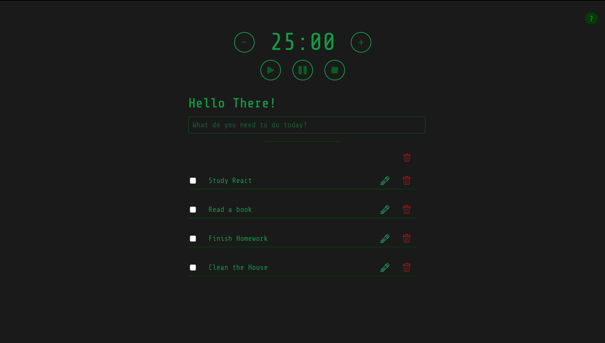

# 🖊️ Just Another Task Manager 📓

> A simple task manager and pomodoro timer that stores data in the browser's IndexedDB. Made using React and Dexie.js.



### Access the app running live: [Just Another Task Manager](https://justanothertaskmanager.herokuapp.com/)

---

## Features

There's nothing much yet:

- Create a task
- Mark task as finished
- Delete a task
- Edit a task
- Pomodoro Timer
- Set a task priority
- Delete all tasks

## How to use

### Tasks

- Type your task and hit enter
- You can add a priority to the task using @ followed by the priority keyword. e.g “Write a blog post @today”
- There are four different priorities to be assigned to a task: today, low, high, critical.
- You can double-click the task or click the edit button to edit the task name.
- You can click the thrash button above the task's list to delete all tasks at once.
- You can click the thrash button next to the task's to delete a task.
- Click the checkbox to complete a task.

### Pomodoro Timer

- There are five buttons near the Timer. The three below the timer let you start, stop and reset the timer, respectively.
- Next to the timer, there are more two buttons. Use them to increase or decrease the time
- In the upper-right corner you'll find a button leading you to the Wikipedia's Pomodoro Timer article, in case you want to learn more about this technique.

## To Do

- [x] Notifications
- [x] Pomodoro Timer
- [x] Task priority

---

## To run locally 🚀

1. Clone the repository:

   ```
   $ git clone https://github.com/VictorGom3s/JustAnotherTaskManager.git
   ```

2. Navigate to the app folder:

   ```
   $ cd JustAnotherTaskManager
   ```

3. Install the dependencies:

   ```
   $ npm install
   ```

4. Run the app:
   ```
   $ npm run start
   ```

---

#### Made in React, for learning purposes.
